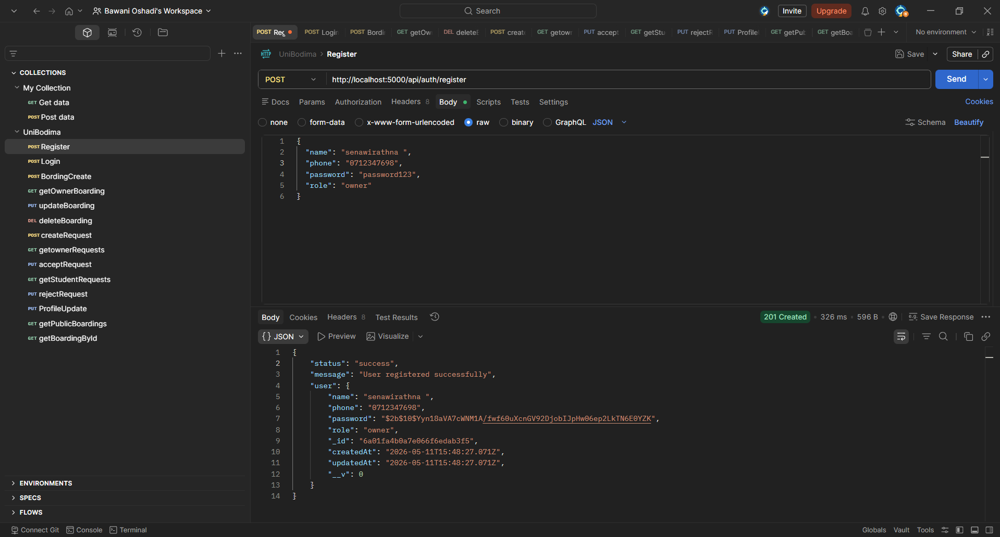
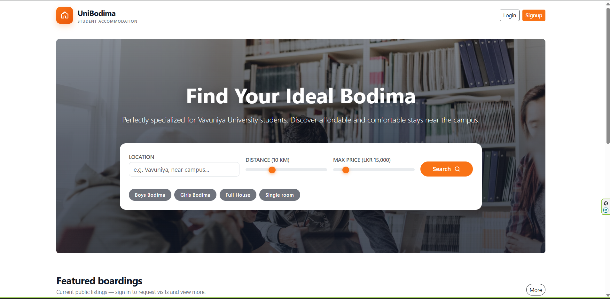
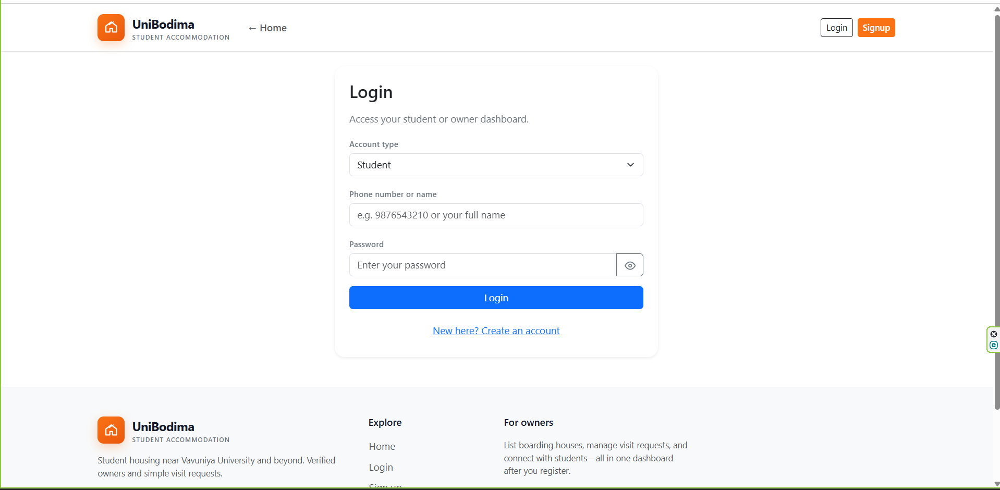
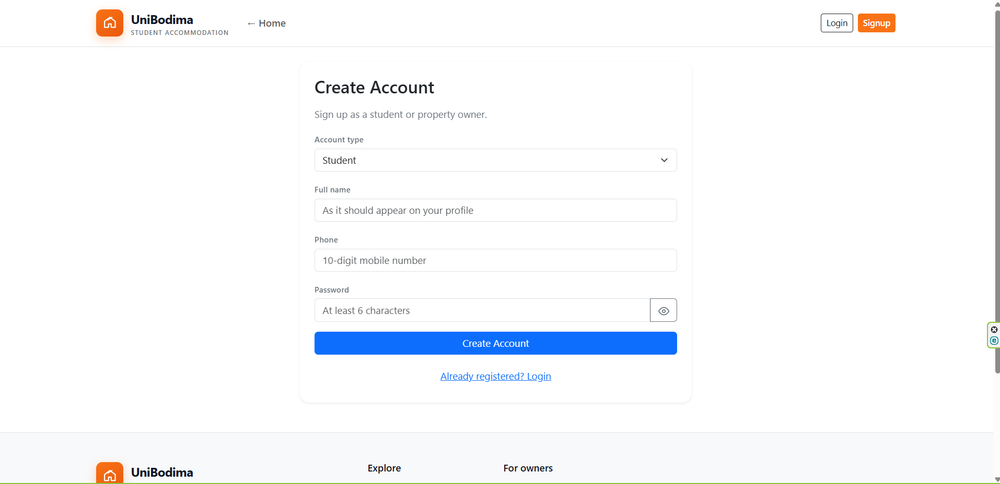
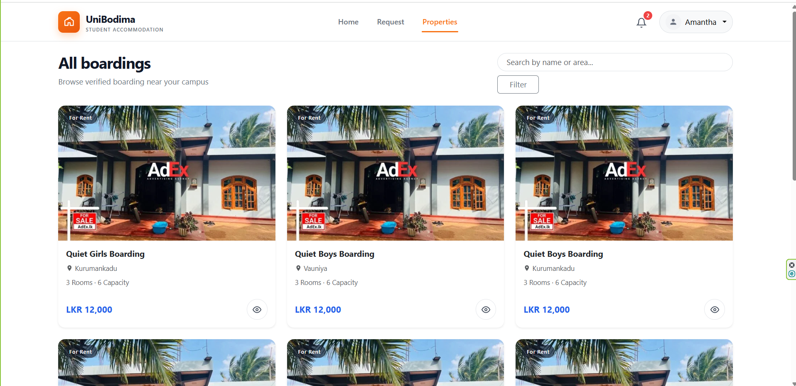

# UniBodima 🏠
### The Premier Student Housing Platform for Vavuniya University

UniBodima is a comprehensive real-estate platform designed specifically for students at the **University of Vavuniya, Sri Lanka**. It bridges the gap between property owners and students, making the process of finding and managing "Bodimas" (boarding houses) and annexes seamless, safe, and efficient.

---

## 🛑 Problem Description
Finding suitable accommodation near the Vavuniya University campus is often a manual, time-consuming process for students. Key challenges include:
- **Lack of Centralized Information**: Students often rely on physical notices or word-of-mouth.
- **Verification Issues**: Difficulty in verifying the facilities and safety of a property before visiting.
- **Communication Gaps**: No structured way for owners to manage student inquiries and visit requests.

## ✅ Proposed Solution
UniBodima provides a digital marketplace tailored to the local housing landscape of Vavuniya. It offers:
- **Centralized Listings**: A single hub for all available student housing near Pampaimadu and Kurumankadu.
- **Property Details**: Extensive information including distance from university, capacity, and specific student categories (Girls only, Boys only, etc.).
- **Direct Interaction**: A structured request system that connects students directly with owners via interest notifications and phone calls.

---

## ✨ Features
- **Role-Based Authentication**: Distinct dashboards and capabilities for students and property owners.
- **Property Management (Owners)**: Full CRUD operations for owners to list, edit, and delete their properties.
- **Interest Requests**: Students can send "Visit Requests" to owners, who can then manage them through their dashboard.
- **Detailed Property Views**: High-quality imagery, interactive feature lists, and owner contact information.
- **Real-Time Feedback**: Integration with `react-hot-toast` and `sweetalert2` for a modern, responsive user experience.
- **Responsive Design**: Fully optimized for mobile, tablet, and desktop viewing.

---

## 🛠 Technologies Used

### Frontend
- **React.js + Vite**: Modern, fast development environment.
- **TypeScript**: Ensuring type safety and scalable code.
- **Bootstrap 5 + React-Bootstrap**: Professional styling and grid system.
- **React Router 6**: Dynamic client-side routing.
- **Axios**: Smooth API communication.
- **Lucide Icons / React Icons**: Consistent, beautiful iconography.

### Backend
- **Node.js + Express**: Scalable server-side logic.
- **MongoDB + Mongoose**: Flexible NoSQL database for property and user data.
- **JSON Web Tokens (JWT)**: Secure user sessions and authentication.
- **Dotenv**: Secure environment variable management.

---

## 🌐 API Endpoints (with Examples)

### 🔑 Authentication

#### 1. Register User
`POST /api/auth/register`
- **Request Body:**
```json
{
  "name": "Kamal Perera",
  "phone": "0712345678",
  "password": "password123",
  "role": "student"
}
```
- **Success Response:**
```json
{
  "status": "success",
  "message": "User registered successfully"
}
```

#### 2. User Login
`POST /api/auth/login`
- **Request Body:**
```json
{
  "identifier": "0712345678",
  "password": "password123"
}
```
- **Success Response:**
```json
{
  "status": "success",
  "token": "eyJhbGciOiJIUzI1Ni...",
  "user": {
    "name": "Kamal Perera",
    "role": "student"
  }
}
```

### 🏠 Boarding Listings

#### 1. Get Public Boardings
`GET /api/boardings/public`
- **Success Response:**
```json
{
  "status": "success",
  "boardings": [
    {
      "_id": "645a...",
      "title": "Luxury Annex near Vavuniya Campus",
      "price": 15000,
      "location": "Pampaimadu"
    }
  ]
}
```

#### 2. Create Boarding (Owner Protected)
`POST /api/boardings/createBoarding`
- **Headers:** `Authorization: Bearer <token>`
- **Request Body:**
```json
{
  "title": "Quiet Girls Boarding",
  "location": "Kurumankadu",
  "distanceFromUniversity": "1.5",
  "price": 12000,
  "roomCount": 3,
  "studentsCapacity": 6,
  "description": "Clean and safe place for female students."
}
```

### 📩 Request System

#### 1. Send Visit Request
`POST /api/requests/create`
- **Request Body:**
```json
{
  "boardingId": "645a...",
  "studentName": "Kamal Perera",
  "studentPhone": "0712345678"
}
```
- **Success Response:**
```json
{
  "status": "success",
  "message": "Request sent to owner"
}
```

---

## 🚀 Setup Instructions

1. **Clone the project**
   ```bash
   git clone the repository
   cd UniBodima
   ```

2. **Backend Configuration**
   - Navigate to the `Backend` folder.
   - Install dependencies: `npm install`
   - Create a `.env` file and add:
     ```env
     PORT=5000
     MONGO_URI=your_mongodb_connection_string
     JWT_SECRET=your_super_secret_key
     ```

3. **Frontend Configuration**
   - Navigate to the `Frontend` folder.
   - Install dependencies: `npm install`
   - Ensure the API base URL in `src/api.ts` points to `http://localhost:5000/api`.

---

## 💻 How to Run the Project

1. **Start the Backend Server**
   ```bash
   cd Backend
   npm start
   ```
   *The server should run on `http://localhost:5000`*

2. **Start the Frontend Application**
   ```bash
   cd Frontend
   npm run dev
   ```
   *The application will be available at `http://localhost:5173`*

---

## 📸 Screenshots

| Landing Page | Search & Filters | Property Details |
| :---: | :---: | :---: |
|  |  |  |

| Owner Dashboard | My Properties | Requests Management |
| :---: | :---: | :---: |
|  |  |  |

| Mobile View | Mobile View | Mobile View |
| :---: | :---: | :---: |
|  |  |  |


---

Developed for the students of **University of Vavuniya**. 🎓
